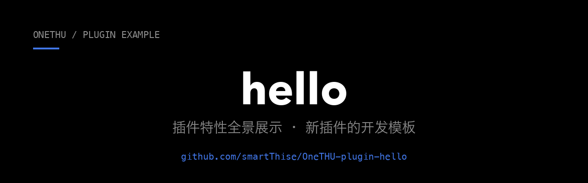

**插件特性全景展示——也是一个可以直接改的新插件模板。**

`12 项能力全覆盖 · 48 条离线断言 · 单文件 ES 模块`

---

**hello 是 [OneTHU](https://github.com/smartThise/OneTHU) 的官方示例插件。**

[OneTHU](https://github.com/smartThise/OneTHU) 是清华校园套件：统一身份、统一数据层、统一界面，覆盖 macOS / Windows / Android。
本仓库演示插件的全部能力入口（命令、弹窗、功能页、原子化收藏、桌面小组件、系统通知、与 OH 双向联动），
既是功能演示，也是新插件的起手模板：克隆本仓库、改 `plugin.js` 即可。

## 特性覆盖

| 特性 | 对应入口 |
|---|---|
| 命令 + 结构化结果（markdown/items/kv） | 管理页命令「结构化结果演示」 |
| 确认弹窗（含 danger 红样式） | 命令「危险确认演示」/ 功能页按钮 |
| 通用表单弹窗（text/select/textarea） | 命令「定制问候（表单演示）」 |
| 剪贴板写入 | 命令「复制问候语」/ 功能页按钮 |
| 自建功能页（tab）+ 自由 DOM 渲染 | 侧栏「Hello」入口 |
| 全局 CSS 注入（`[data-plg]` 作用域规约） | `registerCss` |
| 原子化收藏（万物原子化体系） | 功能页「收藏当前计数」→ 收藏夹出现卡片 |
| OH 联动（反向被调） | 对 OH 说「用 Hello 插件打个招呼」→ `run_plugin_cmd` |
| OH 联动（正向调用） | 命令「问 OH 一句话」→ `plugins.call("onethu.harness","chat")` |
| 桌面小组件（Android） | `registerWidget` 声明式小组件；命令「我的小组件占哪个槽位」告诉你把哪个「OneTHU 插件小组件 N」放到桌面 |
| 系统通知（三端） | 命令「发一条系统通知（10 秒后）」→ `onethu.notify.send`，点通知回到本插件功能页 |

## 文件

- `plugin.js`：插件本体（单文件 ES 模块：`manifest` 导出 + 默认导出激活函数），分节注释对应各特性
- `test.mjs`：离线测试（mock 宿主 ctx，48 断言），`node test.mjs` 直跑
- `docs/banner.png`：本 README 顶部横幅（与 OneTHU 主仓库同一套视觉：黑底白字 + 品牌强调色）

## 安装

OneTHU → 插件 → 安装面板「GitHub 仓库」输入 `smartThise/OneTHU-plugin-hello`；
或在 [插件市场](https://github.com/smartThise/OneTHU-Market) 搜索「Hello」。

从 1.x 升级：管理页 Hello 卡片出现更新按钮，覆盖安装即可。

## 相关仓库

| 仓库 | 说明 |
|---|---|
| [OneTHU](https://github.com/smartThise/OneTHU) | 主程序：macOS / Windows / Android 三端与全部文档 |
| [OneTHU-Market](https://github.com/smartThise/OneTHU-Market) | 插件市场名单（人工审查收录社区插件） |
| [OneTHU-theme-barbie](https://github.com/smartThise/OneTHU-theme-barbie) | 另一个官方示例：主题插件 |
| [OneTHU-Harness](https://github.com/smartThise/OneTHU-Harness) | 内置 Rust 骨干插件：大模型对话助手 |

## 开发文档

插件开发指南与接口参考都在主仓库：

- [插件开发指南](https://github.com/smartThise/OneTHU/blob/dev3/docs/plugin-development.md)：§6 UI 通道与结构化结果、§6.3 自建功能页、§6.4 原子化收藏、§6.5 声明式桌面小组件、§6.6 系统通知、§9.4 OH 联动
- [API 参考](https://github.com/smartThise/OneTHU/blob/dev3/docs/api-reference.md)：`ctx.onethu.*` 逐方法说明
- [架构说明](https://github.com/smartThise/OneTHU/blob/dev3/docs/architecture.md)：数据层、通知与小组件的整体设计
